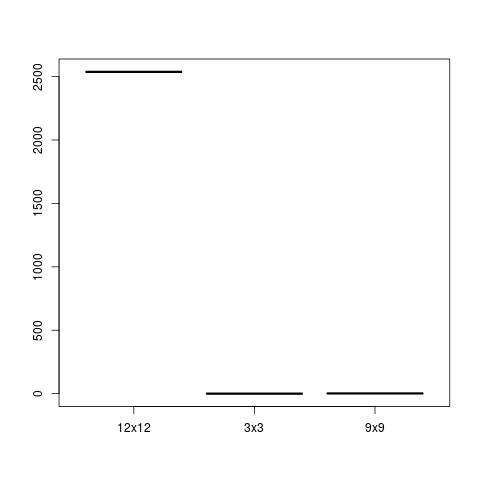
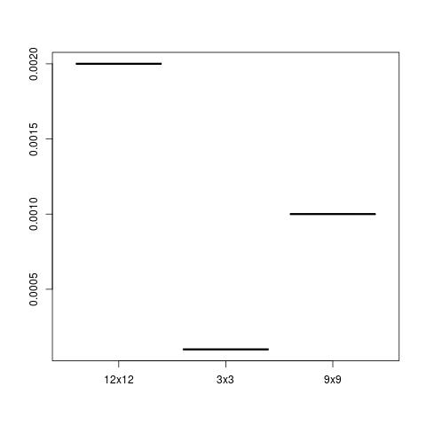
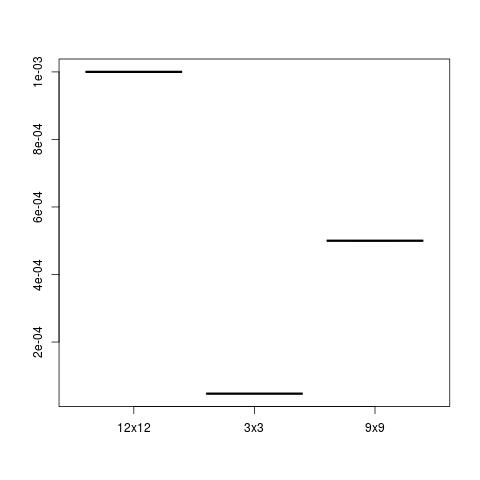

### Testausdokumentaatio

#### Suorituskykytestaus
* Testasin Matriisi-luokan metodeita 3x3,9x9,12x12 matriiseilla
* Testatut matriisit olivat porrasmatriiseja, joiden kaikki nollasta poikkeavat arvot ovat ykkösiä

##### Matriisin determinantti
* Aikaa meni determinantin laskuun 3x3 matriisissa:2.837e-5 sekunttia, 9x9 matriisissa:1.76 sekunttia ja 12x12 matriisissa: 2536.78 sekunttia

##### Matriisin transponointi
* Aikaa meni matriisin transponoinnissa 3x3 matriisissa:1.67e-05 sekunttia, 9x9 matriisissa:4.48e-05 sekunttia ja 12x12 matriisissa:0.001 sekunttia

##### Matriisin inversio
* Aikaa meni matriisin inversionnissa 3x3 matriisissa:9.98e-05 sekunttia, 9x9 matriisissa:0.001 sekunttia ja 12x12 matriisissa:0.002 sekunttia

##### Gauss-Jordan eliminointi
* Aikaa meni Gauss-Jordanin eliminoinnissa 3x3 matriisissa:4.72e-05 sekunttia, 9x9 matriisissa:0.0005 sekunttia ja 12x12 matriisissa:0.001 sekunttia

